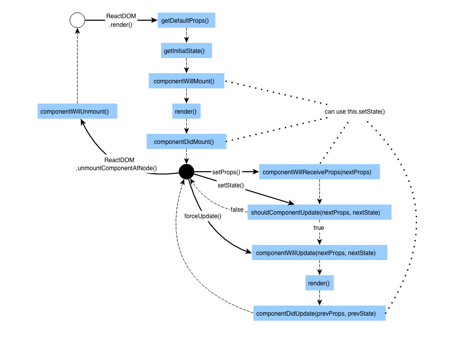

# React
- [component lifecycle](http://dbertella.github.io/react-lifecycle-svg/)
  
- props
- state

## JSX


## ES2015 syntax
```
import React from 'react';

class MyComponent extends React.Component {
  constructor() {
    this.handleClick = this.handleClick.bind(this);
  }
  handleClick = () => {
    console.log('hello world');
  };
  render() {
    return (
      <button onClick={this.handleClick}>Say Hello</button>
    );
  }
}
Contacts.propTypes = {

};
Contacts.defaultProps = {

};

export default MyComponent;
```
## Hoc

## Workshop by nodeschool
https://github.com/kohei-takata/learnyoureact
