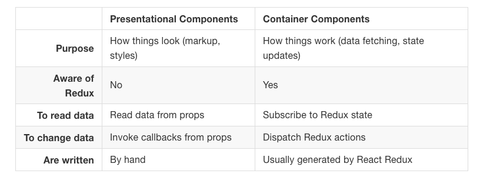

# Redux
http://redux.js.org  
Redux itself is very simple.
App’s state is described as a plain object.
```
{
  todos: [{
    text: 'Eat food',
    completed: true
  }, {
    text: 'Exercise',
    completed: false
  }],
  visibilityFilter: 'SHOW_COMPLETED'
}
```
This object is like a “model” except that there are no setters.

To change something in the state, you need to dispatch an action.
Actions are plains JavaScript object
- `{ type: 'ADD_TODO', text: 'Go to swimming pool' }`
- `{ type: 'TOGGLE_TODO', index: 1 }`
- `{ type: 'SET_VISIBILITY_FILTER', filter: 'SHOW_ALL' }`

Reducer, a function that takes state and action as arguments, and returns the next state of the app.

Split reducers in smaller functions managing parts of the state:
```
function visibilityFilter(state = 'SHOW_ALL', action) {
  if (action.type === 'SET_VISIBILITY_FILTER') {
    return action.filter;
  } else {
    return state;
  }
}
```
```
function todos(state = [], action) {
  switch (action.type) {
  case 'ADD_TODO':
    return state.concat([{ text: action.text, completed: false }]);
  case 'TOGGLE_TODO':
    returns state.map((todo, index) =>
      action.index === index ?
        { text: todo.text, completed: !todo.completed } :
        todo
   )
  default:
    return state;
  }
}
```
A reducer that manage the complete state calling all small reducers:
```
function todoApp(state = {}, action) {
  return {
    todos: todos(state.todos, action),
    visibilityFilter: visibilityFilter(state.visibilityFilter, action)
  };
}
```
90% of the code is just plain JavaScript, with no use of Redux itself, its APIs, or any magic.

## Redux Api
Create store with redux method `createStore`, it accept two arguments, combined reducers
and persisted state (optional).
Use `combineReducers` to combine different reducers in one.
```
import { createStore, combineReducers } from 'redux';

import todos from './todos';
import counter from './counter';

const reducer = combineReducers({
  todos,
  counter
});
const store = createStore(reducer, persistedState);
```

## React Redux
Presentational and Container Components


### Provider
Then you will use `Provider` component in JSX with store as a prop:
```
  import { Provider } from 'react-redux';

  <Provider store={store}>
    <App />
  </Provider>
```

### Container Components
React component that uses `store.subscribe()` to read a part of the Redux state tree and supply props to a presentational component it renders.

### connect()

**mapStateToProps()**  
a function that tell how to transform the current Redux store state into the props you want to pass.
```
const mapStateToProps = (state) => {
  return {
    todos: state.todos,
  }
}
```
**mapDispatchToProps()**  
a function that receives `dispatch()` method and returns a callback props.
```
const mapDispatchToProps = (dispatch) => {
  return {
    onTodoClick: (id) => {
      dispatch(toggleTodo(id))
    }
  }
}
```
Or better, replace arrow function with ES2015 concise [method definitions](https://developer.mozilla.org/it/docs/Web/JavaScript/Reference/Functions/Method_definitions), available when a function is inside an object:
```
const mapDispatchToProps = (dispatch) => ({
  onTodoClick(id) {
    dispatch(toggleTodo(id))
  },
});
```
Container
```
import { connect } from 'react-redux'

const VisibleTodoList = connect(
  mapStateToProps,
  mapDispatchToProps
)(TodoList)

export default VisibleTodoList
```
Presentational
```
import React, { PropTypes } from 'react'
import Todo from './Todo'

const TodoList = ({ todos, onTodoClick }) => (
  <ul>
    {todos.map(todo =>
      <Todo
        key={todo.id}
        {...todo}
        onClick={() => onTodoClick(todo.id)}
      />
    )}
  </ul>
)

TodoList.propTypes = {
  todos: PropTypes.arrayOf(PropTypes.shape({
    id: PropTypes.number.isRequired,
    completed: PropTypes.bool.isRequired,
    text: PropTypes.string.isRequired
  }).isRequired).isRequired,
  onTodoClick: PropTypes.func.isRequired
}

export default TodoList
```

## Middlewares


## Redux glossary
https://github.com/reactjs/redux/blob/master/docs/Glossary.md

## Redux workshop React Europe 2016
https://github.com/gaearon/workshop
